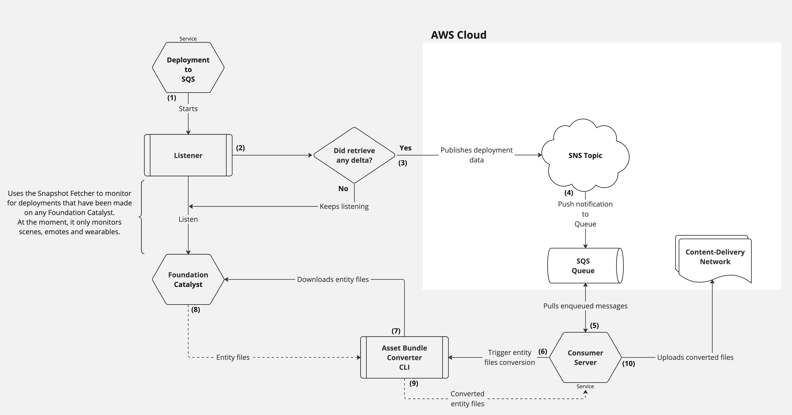

# Consumer Server

The **Consumer Server** is tasked with receiving deployment notifications from the [deployments-to-sqs](https://github.com/decentraland/deployments-to-sqs) service and handling them to facilitate efficient importing within WebGL environments.

The initial deployments made to the Catalysts can be significantly optimized by re-importing all the `gltf` files and transforming them into AssetBundles. This optimization leads to accelerated importing and loading processes on the client-side.

## Optimization Workflow

As outlined in [deployments-to-sqs](https://github.com/decentraland/deployments-to-sqs), notifications for `wearables`, `emotes`, and `scenes` deployments are communicated through an AWS SNS topic named `deployments-sns-${env}`. This optimization can only be applied to deployments of these specific entity types.

The Consumer Server continuously monitors the `ab-conversion-queue` SQS queue, which acts as a subscriber to the aforementioned SNS topic. Consequently, whenever a new deployment arrives in the queue, the server processes it and makes the resulting artifacts accessible through a Content Delivery Network (CDN).

Upon completing the process of making artifacts available on the CDN, each entity will possess two distinct versions:
* The optimized variant residing within the CDN
* The original variant residing on the Catalysts

Consequently, at the present moment, clients will primarily attempt to retrieve entity deployment artifacts from the CDN. If these artifacts cannot be located, the clients will proceed to acquire them from any available Catalyst source.

You may find below a chart detailing the current workflow to convert entities deployments:

